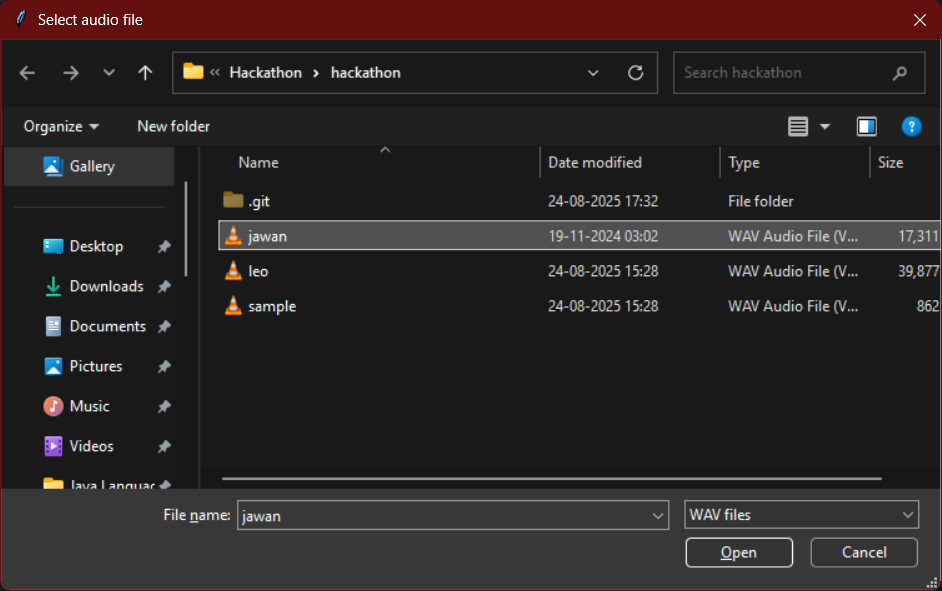

# Beat Detection & Rhythm Visualizer : Team Rahu - Ketu 

## ScreenShot And Video



## Overview

This program analyzes uncompressed WAV audio files to detect beats in near real-time using a custom beat detection algorithm based on changes in the audio’s spectral energy. It visualizes detected beats with a dynamic, colorful animation using Pygame, which includes pulsing circles, rotating frequency bars, and particle effects that respond to the beat pattern. Audio playback is handled by `sounddevice`, and `numpy` is used to perform Fast Fourier Transform (FFT) on audio frames to extract frequency information.

## How It Works (Beat Detection Algorithm)

The beat detection algorithm splits the audio into small overlapping frames and applies a Hann window to each frame to reduce spectral artifacts. It calculates the frequency spectrum using FFT and separates it into bass, mid, and treble frequency bands. The total energy in these bands is computed, and the algorithm detects a beat by identifying significant *onsets*—sudden increases in audio energy—by comparing the current energy with that of the previous frame. It adapts to varying music dynamics by maintaining a history of recent energy onsets and setting a dynamic threshold based on their average and variability. Beats are detected when the current onset exceeds the threshold and a minimum refractory time has passed since the last beat, preventing false or repeated detections.

## Features

- Input: WAV audio files (uncompressed)
- Real-time audio playback and visualization synchronization
- Beat-triggered visual effects including pulsing central circle and colorful particle animations
- Circular frequency spectrum bars that rotate around the central pulse
- Configurable parameters for beat detection sensitivity and refractory period
- File picker dialog for easy audio file selection

## Libraries Used

- [`numpy`](https://numpy.org/) for numerical operations and FFT calculations
- [`soundfile`](https://pysoundfile.readthedocs.io/) for audio file reading
- [`sounddevice`](https://python-sounddevice.readthedocs.io/) for audio playback
- [`pygame`](https://www.pygame.org/news) for graphics and visualization
- [`tkinter`](https://docs.python.org/3/library/tkinter.html) for file selection dialog

## How to Run

1. Ensure you have Python 3 and the required libraries installed:
   ```
   pip install numpy sounddevice soundfile pygame
   ```
2. Run the program:
    1. With File Selected from File Explorer :
   ```
   python beat_visualizer.py
   # Select a WAV audio file via the file dialog when prompted
   ```

    2. With File Given As Argument :
   ```
   python beat_visualizer.py filename.py
   ```
3. Enjoy the real-time beat visualization synchronized with the music playback.

***

This README covers the source code purpose, algorithm explanation, used libraries, and instructions, fulfilling the hackathon deliverable requirements.

If you want, I can help you write a shorter or more detailed version !
